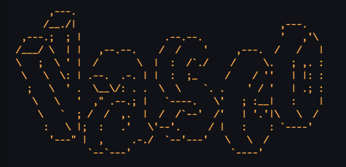

# Vasco



Minimalist Neovim configuration to nudge VSCode users to throw away their mouse (mostly).

## ✨ Features

Vasco is a feature-rich Neovim configuration designed for developers who want to maximize productivity with keyboard-driven workflows:

### 🚀 Core Features

- **File Explorer**: Neo-tree file browser with git integration and preview
- **Fuzzy Finding**: Telescope-powered search across files, buffers, and text
- **Language Server Protocol**: Full LSP support with autocompletion, diagnostics, and code actions
- **Syntax Highlighting**: Tree-sitter support for 25+ programming languages
- **Smart Autocompletion**: Multi-source completion with snippets support
- **Git Integration**: Real-time git status indicators and signs
- **Terminal Integration**: Built-in terminal with smart toggling
- **Buffer Management**: Clean tab-like interface for multiple files
- **Status Bar**: Informative status line with mode indicators
- **Auto Formatting**: Intelligent code formatting on save
- **Indentation Guides**: Visual indentation markers
- **Color Theme**: Carefully crafted dark theme for optimal coding experience

### 🎯 Supported Languages
Python, JavaScript, TypeScript, Lua, Go, Rust, C/C++, HTML, CSS, SQL, Docker, Terraform, Markdown, JSON, YAML, and many more!

## ⌨️ Essential Keymaps

> **Leader Key**: `Space` (Most shortcuts use this prefix)

### 📁 File Operations
- `<C-s>` - Save file
- `<C-q>` - Quit file
- `<leader>sn` - Save without formatting
- `<Tab>` / `<S-Tab>` - Next/previous buffer
- `<leader>x` - Close buffer
- `<leader>b` - New buffer

### 🔍 Search & Navigation
- `<leader>sf` - Find files
- `<leader>sg` - Grep search
- `<leader>sw` - Search current word
- `<leader>sh` - Search help
- `<leader>sk` - Search keymaps
- `<leader>/` - Fuzzy search current buffer
- `<C-d>` / `<C-u>` - Scroll down/up and center

### 🪟 Window Management
- `<leader>v` - Vertical split
- `<leader>h` - Horizontal split
- `<leader>se` - Equalize splits
- `<leader>xs` - Close current split
- `<C-hjkl>` - Navigate between splits
- `<leader>hijkl` - Alternative split navigation

### 📋 Tabs
- `<leader>to` - New tab
- `<leader>tx` - Close tab
- `<leader>tn` / `<leader>tp` - Next/previous tab

### 🛠️ LSP & Code
- `gd` - Go to definition
- `gr` - Go to references
- `gD` - Go to declaration
- `gI` - Go to implementation
- `<leader>rn` - Rename symbol
- `<leader>ca` - Code actions
- `<leader>D` - Type definition
- `<leader>ds` - Document symbols
- `<leader>ws` - Workspace symbols
- `<leader>th` - Toggle inlay hints
- `[d` / `]d` - Navigate diagnostics
- `<leader>d` - Show diagnostic message
- `<leader>q` - Show diagnostics list

### 🖥️ Terminal
- `<C-`>` - Toggle terminal (vertical)

### 🎨 Editor
- `<leader>lw` - Toggle line wrapping
- `<leader><arrows>` - Resize windows

## 📦 Installation

First we must install some dependencies:

<details>

<summary>For MacOS</summary>

```bash
brew install ripgrep
```

</details>

<details>

<summary>For Debian/Ubuntu</summary>

```bash
sudo apt install ripgrep
```

</details>

Then we can clone the repository in our neovim config directory:

```bash
git clone https://github.com/soumik12345/vasco.git ~/.config/nvim
```

## 🙏 Acknowledgments

- [kickstart.nvim](https://github.com/nvim-lua/kickstart.nvim)
- [Neovim Kickstart Config](https://github.com/hendrikmi/neovim-kickstart-config)
